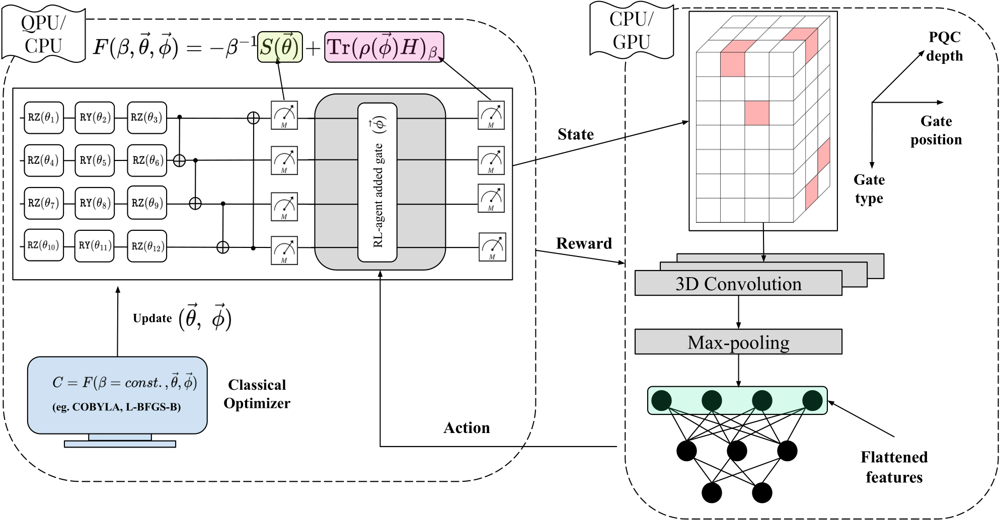
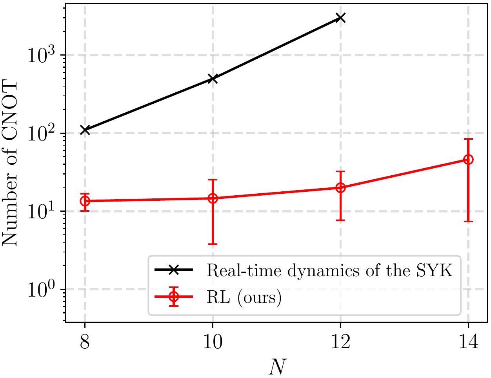

# Improved thermal state preparation of SYK model on QPU with RL and CNN ([Paper](https://arxiv.org/abs/2501.11454))

<div style="font-size: 20px;">



<hr>
<hr>

<p>
</p>

<h1 id="The-list-of-contents"> <b> The list of contents</b></h1>

<ol>
    <li><a href = "#What is SYK model?">What is SYK model?</a></li>
    <li><a href = "#The main bottleneck we tackle">The main bottleneck we tackle</a></li>
    <li><a href = "#Why CNN?">Why CNN?</a></li>
    <li>
    <a href="#How to run the simulations?">How to run the simulations?</a>
    <ul>
      <li><a href="#Making the environment">Making the environment</a></li>
      <li><a href="#Noiseless simulations">Noiseless simulations</a></li>
      <li><a href="#Noisy simulations">Noisy simulations</a></li>
    </ul>
    <a href="#Extracting the results">Extracting the results</a>
    <ul>
      <li><a href="#The data to generate plots">Making the environment</a></li>
      <li><a href="#Noiseless simulations">The data used to generate plots in the paper</a></li>
      <li><a href="#The SYK Hamiltonian generation">The SYK Hamiltonian generation</a></li>
    </ul>
    <li><a href = "#Citing my work">Citing my work</a></li>
      
  
</ol>
<hr>
<hr>
<p>
</p>


<h1 id="What is SYK model?"> <b> What is SYK model?</b></h1>

The Sachdev-Ye-Kitaev (SYK) model is a quantum mechanical system that has garnered significant attention in both condensed matter and high-energy physics due to its unique properties and connections to quantum gravity. The model consists of a large number (N) of interacting fermions in zero spatial dimensions and one time dimension. These fermions interact with each other through random all-to-all couplings, meaning each fermion can interact with any other fermion in the system. This randomness in interactions is a key feature of the model. Key characteristics of the SYK model include:

1. **Exact solvability:** Despite its complexity, the model can be solved exactly in certain limits, making it a valuable tool for theoretical studies.

2. **Quantum chaos:** The model exhibits maximal quantum chaos, a property shared with black holes.

3. **Holographic duality:** The SYK model is believed to be related to quantum gravity in a negatively curved spacetime, specifically to black holes in nearly Anti-de Sitter (AdS) space.

4. **Emergent conformal symmetry:** At low temperatures, the model displays an approximate conformal symmetry, a feature important in quantum field theories.

5. **Relevance to condensed matter systems:** The model has potential applications in understanding strongly correlated materials and strange metals.

The model's unique combination of properties makes it a powerful tool for exploring fundamental questions in quantum mechanics, gravity, and the nature of spacetime. Its study has led to insights in areas ranging from quantum information to black hole physics, making it a focal point of research in theoretical physics.

[Back to Top](#The-list-of-contents)
<hr>
<p>
</p>

<h1 id="The main bottleneck we tackle"> <b>The main bottleneck we tackle</b></h2>

Preparing thermal states for large SYK systems (N > 12) on current quantum devices poses a significant challenge due to the increasing complexity of parameterized quantum circuits. To address this, we propose an innovative approach

- **Combining reinforcement learning (RL) framework with convolutional neural networks (CNNs)**, our method refines both the quantum circuit structure and its parameters. Hence overcome the limitations of traditional variational methods and make the preparation of thermal state beyond 12 Majorana fermions possible on near-term quantum hardware.

For an example we improve CNOT count by at least 100-fold (for N > 10) compared to first-order Trotterization (for $\beta=$ inverse temperature $=5.2$)!**
<p align="center">
  
</p>

[Back to Top](#The-list-of-contents)
<hr>
<hr>

<p> 
</p>

<h1 id="Why CNN?"> <b>Why CNN?</b></h2>

A binary encoding scheme encodes quantum circuit into a 3D tensor as RL-state capturing the order and arrangement of gates. CNN instead of a FNN is prefered because of the following reasons:

- Unlike methods that flatten the 3D encoding into a single dimension (e.g. in FNNs) this scheme retains the **full 3D structure**.

- **The spatial structure is directly leveraged using a 3D-CNN**, enabling more effective learning and representation of quantum circuit features.

To soldify the advantage with CNN we consider two distinct 4-qubit Hamiltonians (1) The $N=8$ SYK dense Hamiltonian and (2) an $\texttt{LiH}$ molecule with $3.4$ bond distance. This encoding scheme improves the agent's ability to process and analyze quantum circuits as can be seen here:


[Back to Top](#The-list-of-contents)
<hr>
<hr>
<p>
</p>


<h1 id="How to run the simulations?"> <b>How to run the simulations?</b></h2>

Here we will elaborate how to run the code provided in the repository. Instead of giving an `.yml` file for the environment I am going to stepwisely install all the dependencies in the next few steps. Please note that the code was used on Ubuntu GNU/Linux 22.04.4 LTS (64-bit).


<h2 id="Making the environment"> <b>Making the environment</b></h2>


**Step 1:** For this project, we use Anaconda which can be downloaded from https://www.anaconda.com/products/individual.


**Step 2:** 
```
conda env create -f syk_rl.yml
```

**Step 3:** 
```
conda activate syk_rl
```

<p>
</p>

<h2 id="Noiseless simulations"> <b>Noiseless simulations</b></h2>

After activating the environment we will see how to run the noiseless simulations

**Step 1:** Go to the folder `noiseless`

**Step 2** If you want to run the code with `3D-CNN` then use
```
python main_syk_finite.py --seed 1 --config vanilla_cobyla_SYK_4q_inst0_layer5_cnn_finite_beta5p2 --experiment_name "3D-CNN/"
```

which means you are running the `main_syk_finite.py` file with the `3D-CNN` initialized with seed $1$ for configuration `vanilla_cobyla_SYK_4q_inst0_layer5_cnn_finite_beta5p2`. If you inspect the `main_syk_finite.py` file you can see that this is where the training of the neural network is happening.

**step 3:** The output after training is saved in `.json` format which is saved in the `results` folder.


<h2 id="Noisy simulations"> <b>Noisy simulations</b></h2>

In the case of noisy simulation

**Step 1:** Go to the folder `noisy`.

the remaining steps are similar to the *noiseless* scenario.

<hr>
<hr>
<p>
</p>

<h1 id="Extracting the results"> <b>Extracting the results</b></h2>

To extract the results and plot the data (say for example the Figure 3 and 4) illustrated in the preprint please follow the details below.

**Step 1:** run the `plot_noiseless_with_rwd_compare.py`

```
python plot_noiseless_with_rwd_compare.py
```
<hr>
<p>
</p>


<h2 id="The data to generate plots"> <b>The data used to generate plots in the paper</b></h2>

The data for the plots in the paper and the codes can be found in:

[Click here to get the data at Zenodo!](https://zenodo.org/records/14726422)

The or train the agent to store data in noiseless scenario and then run

```
python plot_noiseless_with_rwd_compare.py
```

Please note that the noisy training data can also be plotted in similar manner. 

<h2 id="The SYK Hamiltonian generation"> <b>The SYK Hamiltonian generation</b></h2>

In this research the SYK Hamiltonian generation was done using the link:

[A model of quantum gravity on a noisy quantum computer -- code and circuit release](https://zenodo.org/records/10202045)

[Back to Top](#The-list-of-contents)

<hr>
<p>
</p>

<h1 id="Citing my work"> <b>Citing my work</b></h2>

If you find my research helpful kindly cite it as:

```
@misc{kundu2025improving,
    title={Improving thermal state preparation of Sachdev-Ye-Kitaev model with reinforcement learning on quantum hardware},
    author={Akash Kundu},
    year={2025},
    eprint={2501.11454},
    archivePrefix={arXiv},
    primaryClass={quant-ph}
}
```

[Back to Top](#The-list-of-contents)
</div>
